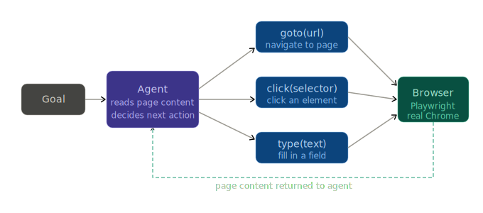

# Browser Automation Agent

An autonomous agent that controls a real web browser — navigating pages, clicking buttons, filling forms, and scraping dynamic content that normal HTTP requests can't reach. 

Built with Python, Gemini API, and Playwright.



## Setup

### Prerequisites
- [uv](https://docs.astral.sh/uv/getting-started/installation/) installed
- A [Gemini API key](https://aistudio.google.com/app/apikey)

### 1. Install & configure

```bash
cd browser-agent

uv sync

# Install the browser engine (Chromium)
uv run playwright install chromium

copy .env.example .env
# Open .env and add your Gemini API key
```

### 2. Run the agent

```bash
uv run main.py
```
### Pipeline 

```
Step 1: User Goal
     │
     ▼
Navigate to URL or Search
     │
     ▼
get_links()  ──► Top 20 clickable paths discovered
     │
     ▼
get_page_content() ──► Structural "Skeleton" of the current page
     │
     ▼
Agent decides next action:
  ├── Click?  ──► click_element() ──► loop back to observe
  ├── Type?   ──► fill_form()      ──► loop back to observe
  └── Done?   ──► task_complete()  ──► Final Answer
```

## Learnings

### The web is just another tool interface
A browser page is an **observation**. A click is an **action**. The agent loop is identical to everything we built — the only difference is the environment is a live webpage instead of a file or an API. This is the mental model that unlocks computer-use agents in the advanced tier.

### Page content needs aggressive truncation
A full webpage can be 50,000+ characters. Sending that raw to the LLM is slow and expensive. We use a **Skeleton Markdown** approach:
- Strip away `nav`, `footer`, `script`, and `style`.
- Keep only headings, buttons, and links.
- Truncate the final result to 3000 characters.

This selective perception allows the agent to navigate complex sites for pennies instead of dollars.

### Selectors are fragile — text matching is more robust
CSS selectors like `#submit-btn` break when sites update their HTML. Clicking by visible text (`page.get_by_text("Search")`) is more resilient because it matches what a human sees. Our tools prioritize text-based interaction with a CSS fallback.

| Tool | Priority | Why |
|---|---|---|
| `get_links` | High | Fast discovery of where to go next |
| `get_page_content` | Medium | Read specific data once arrived |
| `take_screenshot` | Low | Only used for visual debugging if stuck |

