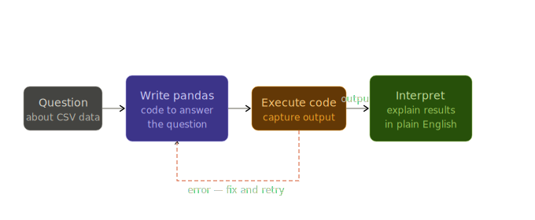

# Data Analyst Agent

An autonomous agent that answers questions about CSV data by writing and executing real Pandas code.

Just Python, Gemini API, and Pandas.



## Setup

### Prerequisites
- [uv](https://docs.astral.sh/uv/getting-started/installation/) installed
- A [Gemini API key](https://aistudio.google.com/app/apikey)

### Install & Run

```bash
# Clone / navigate to the project
cd data-analyst-agent

# Create virtual environment and install dependencies
uv sync

# Add your Gemini API key
copy .env.example .env
# Then open .env and replace the placeholder with your actual key

# Run the agent
uv run main.py
```

## Learnings

### What is Code Execution as Reasoning?

Instead of relying on an LLM's training data, you:

| Phase | What happens |
|---|---|
| **Discover** | Inspect CSV schema → identify column names and types |
| **Compute** | Write Pandas code → execute in a persistent state |
| **Observe** | Capture stdout/stderr → interpret results or fix errors |
| **Explain** | Synthesize the data findings into a natural language answer |

The model computes the answer from *real evidence*, not from memory.

### Why Schema Discovery matters

LLMs often hallucinate column names. Asking "What's the average price?" might fail if the column is actually `sale_amt`. 

By enforcing an **inspect-first** rule, the agent reads the actual metadata before writing a single line of analysis. This mirrors how a professional human analyst works.

### Stateful Execution (Persistence)

Standard LLM loops often lose their context. This agent uses `exec()` with a shared global dictionary, allowing it to keep dataframes in memory across multiple questions.

- **Turn 1:** "Load the sales data." (DataFrame `df` is created)
- **Turn 2:** "What was the average?" (Agent filters the *existing* `df` in memory)

This makes the agent feel like a real-time collaborator rather than a series of disconnected scripts.

### How the pipeline works

```
User query
    │
    ▼
inspect_data() ◄── Agent discovers the schema (First time seeing the file)
    │
    ▼
execute_python_code() ◄── Agent writes and runs Pandas code
    │
    ▼
save_chart() / write_report() ◄── Optional artifacts (PNG/Markdown)
    │
    ▼
Agent observes the output ──► (If error: Loop to fix code)
    │
    ▼
Final answer synthesized from evidence
```

### Key concepts used

- **Inspect-First design** — strictly enforced schema discovery to prevent column-name hallucinations
- **Persistent memory (`exec`)** — keeping data in-memory across turns for faster follow-up questions
- **Tool-use loop** — a ReAct pattern where the agent observes its own code output to self-correct
- **Artifact generation** — specialized tools to produce file-based outputs (charts/reports)
- **Sandboxed workspace** — restricted file operations to the `workspace/` directory for data safety
