# RAG CLI

A high-precision RAG (Retrieval-Augmented Generation) CLI that answers questions strictly from your own documents.

Just Python, Gemini API, and ChromaDB.




## Setup

### Prerequisites
- [uv](https://docs.astral.sh/uv/getting-started/installation/) installed
- A [Gemini API key](https://aistudio.google.com/app/apikey)

### Install & Run

```bash
# Clone / navigate to the project
cd rag-cli

# Create virtual environment and install dependencies
uv sync

# Add your Gemini API key
copy .env.example .env
# Then open .env and replace the placeholder with your actual key

# Index a document
uv run python main.py ingest path/to/your.pdf

# Ask a question
uv run python main.py query "What are the key findings?"

# Ask with re-ranking details
uv run python main.py query "Summarize section 2" --verbose
```


## Learnings

### What is RAG?

**RAG = Retrieval-Augmented Generation** — instead of relying on an LLM's training data, you:

| Phase | What happens |
|---|---|
| **Ingest** | Parse docs → chunk → embed → store in a vector DB |
| **Retrieve** | Embed the query → find nearest chunks by cosine similarity |
| **Generate** | Feed the relevant chunks to the LLM as context |

The model answers from *your documents*, not from memory.

### Why re-ranking matters

Vector similarity is fast but imprecise. A top-10 retrieval will often include chunks that are *topically adjacent* but don't actually answer the question.

Re-ranking sends those 10 candidates to Gemini and asks it to **reason** about which 3 are truly relevant. This dramatically reduces noise before generation.

```
ChromaDB top-10 ──► Gemini re-ranker ──► top-3 ──► answer
```

### Grounding (the knowledge boundary)

LLMs will confidently answer from memory even when told to use a document. This tool enforces a hard system-prompt rule:

> *Answer ONLY using the provided excerpts. If the answer isn't there, say so.*

If your document doesn't contain the answer, the tool says so — rather than hallucinating one.

### How the pipeline works

```
User query
    │
    ▼
get_embeddings()  ← RETRIEVAL_QUERY task type
    │
    ▼
ChromaDB  ──► top-10 nearest chunks
    │
    ▼
re_rank_chunks()  ──► Gemini picks best 3 of 10
    │
    ▼
generate_answer()  ──► strict knowledge-boundary system prompt
    │
    ▼
Answer + Sources (filename, page number)
```

### Key concepts used

- **Recursive character splitter** — chunks respect paragraph/sentence boundaries before falling back to character splits
- **Deterministic chunk IDs** — re-ingesting the same file is always safe (UUID5 from content)
- **Embedding task types** — `RETRIEVAL_DOCUMENT` for ingest, `RETRIEVAL_QUERY` for queries (improves accuracy)
- **Structured re-ranking prompt** — Gemini returns a JSON array of indices, not free text, making parsing robust
