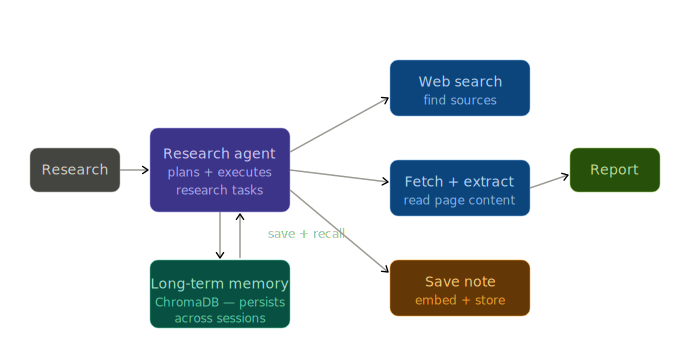

# Research Agent with Long-Term Memory

An AI agent that researches topics by browsing the web, saves findings to persistent memory, and builds a growing knowledge base across sessions. Ask it something today, quit, come back tomorrow — it remembers and builds on what it learned.

This implements the **Recall → Research → Save** pattern using Gemini API, Tavily search, and ChromaDB vector store.

## Setup

### Prerequisites
- Python 3.11+
- [Gemini API key](https://ai.google.dev/) 
- [Tavily API key](https://tavily.com/) 

### Install & Run

```bash
cd research-agent

# Sync dependencies with uv
uv sync

# Add API keys to .env (copy from .env.example)
copy .env.example .env
# Then edit .env with your actual keys

# Run an example
uv run python main.py "what are large language models?"

# Check memory status
uv run python main.py --status

# Clear memory and start fresh
uv run python main.py --clear-memory
```

## Learnings

### What Is Recall → Research → Save?

This agent doesn't start every session from scratch. It follows a three-phase pattern:

| Phase | What happens |
|---|---|
| **Recall** | Query memory: do we know about this topic already? |
| **Research** | If not (or to add new info): search web, fetch pages, analyze |
| **Save** | Store findings with embeddings for future recall |

The loop repeats. Each session adds to what the agent knows.

### Why It Matters

Most AI assistants have amnesia — they answer from training data alone. This agent learns:

- **It remembers past research** — `workspace/research_memory` is its brain persisting between sessions
- **It gets smarter over time** — each run adds knowledge
- **Semantic recall** — ask about "agent design" tomorrow and it surfaces "agentic frameworks" research from last week

Memory separates a tool from an agent.

### How This Agent Works

```
User query
    │
    ▼
[RECALL] Check memory for past findings
    │
    ├── Found relevant past research? Use it.
    │
    ▼
[RESEARCH] Search web → Fetch pages → Analyze
    │
    ▼
[SAVE] Store findings with embeddings in ChromaDB
    │
    ▼
Return answer with citations
```

### The Watch-For Moment

```bash
# Session 1
python main.py "agentic AI frameworks"

# Next day, Session 2
python main.py "differences between LangGraph and CrewAI?"
```

Watch it pull yesterday's research, answer partly from memory before searching for new info. It builds on past context. That's when this pattern clicks.

### Key Concepts

- **Vector memory** — findings stored as embeddings. Related queries find old research without exact word matches.
- **httpx, not Playwright** — research pages are static HTML. No browser needed.
- **Local embeddings** — sentence-transformers runs on your machine. No API calls, no rate limits.
- **Tavily search** — built for AI agents. Clean structured results.
- **Agentic loop** — No framework.
